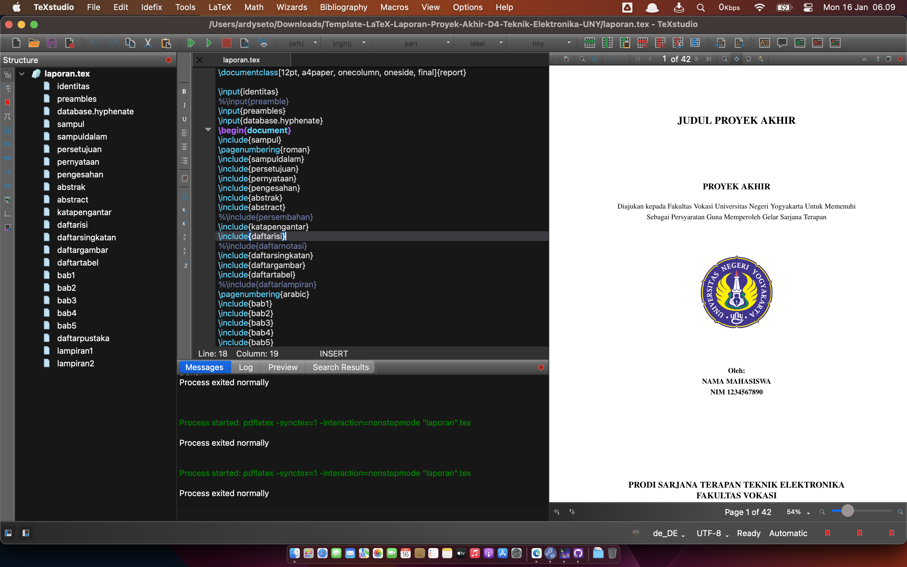
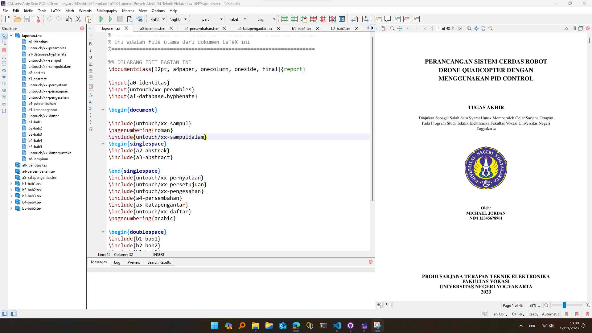

# 📘 Template LaTeX Proposal Praktik Industri

**Program Sarjana Terapan Teknik Elektronika — Fakultas Vokasi UNY**

Repositori ini menyediakan **template LaTeX** resmi untuk penulisan **Laporan Praktik Industri** mahasiswa Program Sarjana Terapan Teknik Elektronika, Fakultas Vokasi, Universitas Negeri Yogyakarta (UNY).

Template ini dirancang agar mahasiswa dapat menyusun laporan dengan format yang **terstandar**, **profesional**, dan mudah disesuaikan. Dengan menggunakan LaTeX, mahasiswa dapat fokus pada konten teknis tanpa direpotkan oleh masalah tata letak dan format dokumen.

---

## 📂 Struktur Folder

```

.
├── LICENSE                      # Lisensi proyek (MIT)                  
├── Project
│   ├── a0-identitas.tex         # Identitas mahasiswa, dosen pembimbing, judul laporan, dll
│   ├── a1-database.hyphenate.tex # Pengaturan pemenggalan kata
│   ├── a2-lampiran.tex          # Daftar lampiran (dapat disesuaikan)
│   ├── b1-bab1.tex              # BAB 1 laporan
│   ├── b2-bab2.tex              # BAB 2 laporan
│   ├── b3-bab3.tex              # BAB 3 laporan
│   ├── b4-bab4.tex              # Tutorial LaTeX (jangan disertakan dalam laporan akhir)
│   ├── gambar/                  # Folder gambar yang digunakan dalam laporan
│   │   ├── gambar-kucing.jpg
│   │   ├── logo-uny.png
│   │   ├── screenshot-miktex.png
│   │   ├── screenshot-texstudio-macos.png
│   │   └── screenshot-texstudio-windows.png
│   ├── kode/                    # Folder kode program (C++, Python, Arduino, Java, dll)
│   │   ├── code_sample.cpp
│   │   ├── code_sample.ino
│   │   ├── code_sample.java
│   │   └── code_sample.py
│   ├── proposal-pi.tex          # File utama (jangan diubah langsung)
│   ├── proposal-pi.pdf          # Contoh hasil kompilasi
│   ├── pustaka.bib              # Daftar referensi dalam format BibTeX
│   └── untouch/                 # Komponen LaTeX penting (jangan diubah)
│       ├── xx-daftar.tex
│       ├── xx-daftarpustaka.tex
│       ├── xx-pengesahan.tex
│       ├── xx-preambles.tex
│       └── xx-sampul.tex
└── README.md                   # Dokumentasi ini

```

---

## 🛠️ Persiapan & Instalasi

### 1. Instalasi MikTeX dan TeXstudio

* **MikTeX**: [https://miktex.org/download](https://miktex.org/download)

  > *Wajib pilih opsi* **for all users** dan **Always** pada on-the-fly installation (khusus Windows).
* **TeXstudio**: [https://www.texstudio.org](https://www.texstudio.org)

### 2. Update MikTeX Packages

Buka **MikTeX Console**, lalu klik **Update All** agar semua paket LaTeX tersedia.

### 3. Unduh Template

* Pilih salah satu:

  * Klik tombol **Code > Download ZIP**
  * Gunakan Git:

    ```bash
    git clone https://github.com/2black0/Template-LaTeX-Proposal-Praktik-Industri.git
    ```

---

## ✍️ Cara Menggunakan Template

1. **Buka `proposal-pi.tex`** di TeXstudio (jangan ubah file ini).
2. **Edit bagian-bagian berikut:**

   * `a0-identitas.tex` → Isi nama, NIM, judul, pembimbing, dsb.
   * `b1-bab1.tex` s.d. `b3-bab3.tex` → Tulis isi laporan sesuai struktur bab.
   * `a2-lampiran.tex` → Tambahkan lampiran (jika ada).
   * `pustaka.bib` → Tambahkan referensi menggunakan Mendeley/Zotero/JabRef.
3. **Kompilasi** dengan klik tombol **Build & View** (`F5` atau ikon panah hijau).
4. **Output laporan** tersedia dalam `proposal-pi.pdf`.

---

## 📺 Video Tutorial

| Materi                                 | Link                                       |
| -------------------------------------- | ------------------------------------------ |
| Tutorial 1 - Dasar Penggunaan Template | [🎥 YouTube](https://youtu.be/lnPTVrOGB90) |
| Tutorial 2 - Penulisan Isi             | [🎥 YouTube](https://youtu.be/4Qk_2pknhsM) |
| Tutorial 3 - Gambar dan Tabel          | [🎥 YouTube](https://youtu.be/oxY1mbZgv94) |
| Tutorial 4 - Referensi & Sitasi        | [🎥 YouTube](https://youtu.be/goq-IS4WJW4) |
| Tutorial 5 - Penulisan Kode Program    | [🎥 YouTube](https://youtu.be/JeSJ0mYfxA0) |
| Workshop Lengkap                       | [🎥 YouTube](https://youtu.be/anMLRydjDOE) |

---

## 📚 Pengelolaan Referensi BibTeX

Disarankan menggunakan salah satu tools berikut untuk mengelola file `pustaka.bib`:

* [Mendeley](https://www.mendeley.com/)
* [Zotero](https://www.zotero.org/)
* [JabRef](https://www.jabref.org/)

---

## 🖼️ Cuplikan Tampilan

| TeXstudio - macOS                                     | TeXstudio - Windows                                     |
| ----------------------------------------------------- | ------------------------------------------------------- |
|  |  |

---

## 📄 Lisensi

Template ini dilisensikan dengan [MIT License](LICENSE).

---

## 🤝 Kontribusi

Kami sangat terbuka untuk perbaikan dan pengembangan template ini.
Silakan buat **pull request** atau ajukan **issue** untuk menyampaikan saran atau laporan bug.

---

## 📬 Kontak

Untuk informasi lebih lanjut hubungi:
**Ardy Seto Priambodo**
✉️ [ardyseto@uny.ac.id](mailto:ardyseto@uny.ac.id)
👤 GitHub: [@2black0](https://github.com/2black0)

---